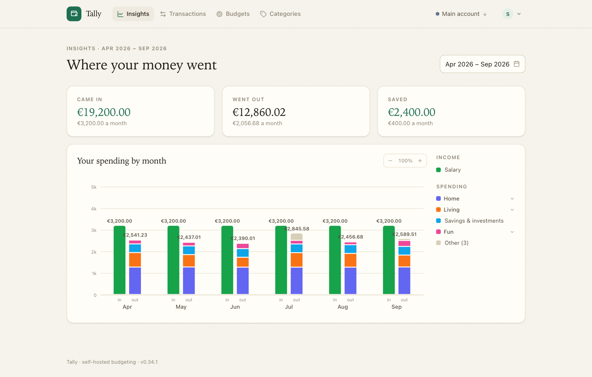
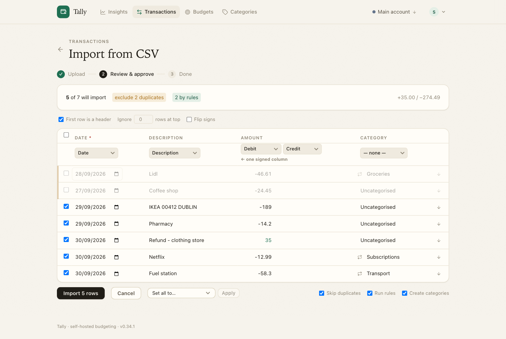
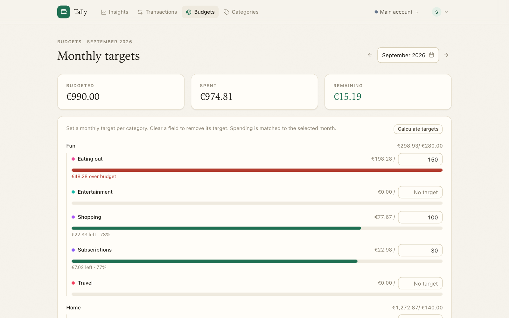

# Tally

**See where your money goes — without handing your bank details to anyone.**

Tally is a simple budgeting app you run yourself, on your own computer or home server.
Download a statement from your bank, drop it into Tally, and it shows you what came in,
what went out, and what you kept. No subscriptions, no bank logins, no data leaving your house.



## What it does

- **Import your bank statement** — upload the CSV file your bank lets you download. Tally works out the columns, spots duplicates, and lets you check everything before it's saved.
- **Sort spending into categories** — Groceries, Rent, Eating out, whatever makes sense to you. Set up simple rules ("anything with *Tesco* in it is Groceries") and Tally sorts new transactions for you.
- **Set monthly budgets** — a target per category, with a clear view of how much is left. Tally can suggest targets based on what you usually spend.
- **Track savings** — money you move into savings counts as money kept, not money spent, so your totals tell the truth.
- **Insights** — one page that answers *where did my money go this month?* Compare any period against your own normal, see which categories shifted the most, and browse a month-by-month picture.
- **Multiple accounts** — a current account and a savings account, say. Transfers between them are never mistaken for income.
- **Shared, but private** — everyone in the household gets their own login, categories and data. Nobody sees anyone else's numbers.
- **Ask Tori (optional)** — add a Claude API key and you can ask questions in plain English: *"How much did I spend on groceries this month?"* or *"Am I over budget on anything?"* Tori can also sort imported transactions into your categories and write a short summary of each period. Off unless you switch it on.

<table>
  <tr>
    <td></td>
    <td></td>
  </tr>
  <tr>
    <td align="center"><sub>Check every row of a statement before it's saved — duplicates are spotted, rules fill in categories</sub></td>
    <td align="center"><sub>Monthly targets, grouped, with what's left at a glance</sub></td>
  </tr>
</table>

## Getting started

Tally runs in [Docker](https://www.docker.com/products/docker-desktop/) — a free tool that
lets you run apps like this with one command. Once Docker is installed, open a terminal and run:

```bash
docker run -d --name tally -p 3000:3000 -v tally-data:/data ghcr.io/thatguy-za/tally:latest
```

Then open **http://localhost:3000** in your browser and create an account. The first account
becomes the admin. Your data is stored in a single file that stays on your machine.

Want a practice run? Import [`sample-transactions.csv`](static/sample-transactions.csv) to see how it looks with some data in it.

**A few settings you might want** (set as environment variables, or in the *Server settings* page once you're logged in):

| Setting | What it does |
|---|---|
| `ALLOW_REGISTRATION=false` | Stop new people signing up once your household has accounts |
| `ANTHROPIC_API_KEY` | Switches on Ask Tori and AI sorting (can also be set in Server settings) |
| `ORIGIN` | Only needed if you put Tally behind a reverse proxy — set it to the address you visit, e.g. `https://tally.example.com` |

Forgot a password? Run `node scripts/reset-password.mjs` on the server.

## Backups

Everything is in one file. Back up the `tally-data` volume (or copy `tally.sqlite` while
the app is stopped) and you have everything.

## For developers

SvelteKit · SQLite via the built-in `node:sqlite` (Node 24+) · Tailwind. No external services,
no native build step, idles under 100 MB RAM.

```bash
npm install && cp .env.example .env && npm run dev   # local dev
npm test                                             # tests (uses a throwaway database)
```

Docker images are published to GitHub Container Registry on every push to `main`.

| Variable | Default | Purpose |
|---|---|---|
| `PORT` | `3000` | HTTP port |
| `DATABASE_PATH` | `/data/tally.sqlite` | Where the SQLite file lives (mount a volume here) |
| `ALLOW_REGISTRATION` | `true` | Set to `false` to close signup |
| `ORIGIN` | – | Public URL when behind a reverse proxy (or pass `X-Forwarded-Proto` / `X-Forwarded-Host` with `PROTOCOL_HEADER` / `HOST_HEADER`) |
| `BODY_SIZE_LIMIT` | `8M` | Max request body, for large CSV imports |
| `ANTHROPIC_API_KEY` | – | Enables Ask Tori and AI categorisation |
